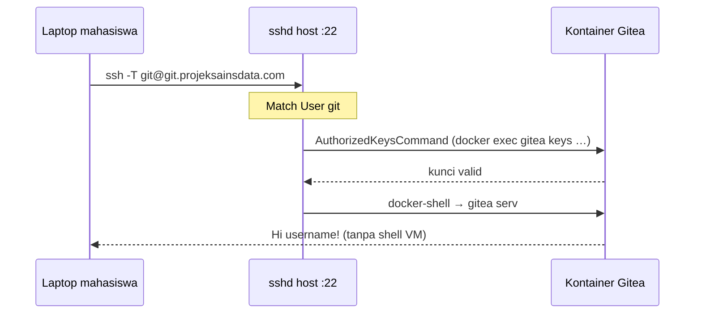

# Path B — SSH Passthrough (Port 22 Tetap Admin)

**Jawaban singkat:** Ya. Port **22** tetap dipakai `sshd` VM untuk admin (`ardikasatria@IP`).  
Mahasiswa menjalankan `ssh -T git@git.projeksainsdata.com` (port 22, user **`git`**) — host sshd **hanya** untuk user `git` meneruskan sesi ke kontainer Gitea. **Bukan shell VM.**

Ini **Path B** di `Instructions/perbaikan-gitea/PERBAIKAN_SSH_GITEA_GITHUB.md` (resmi Gitea: *SSH Container Passthrough*).

---

## Perbandingan

| | Path A | **Path B (ini)** | Path C (interim) |
|---|--------|------------------|------------------|
| Port 22 publik | Gitea | **Admin VM** | Admin VM (berbahaya untuk `git@`) |
| Perintah mahasiswa | `ssh -T git@host` | `ssh -T git@host` | `ssh -p 2222 -T git@host` |
| Pindah sshd admin | **Wajib** (→ 2202) | **Tidak** | Tidak |
| Risiko lockout | Tinggi | Rendah | Rendah |
| Kompleksitas | Sedang | Sedang+ | Rendah |

**Rekomendasi untuk PSD:** Path B jika admin **harus** tetap SSH port 22.

---

## Cara kerja



- **Admin:** `ssh ardikasatria@157.10.160.225` → sshd biasa, **tidak** kena `Match User git`.
- **Git:** user SSH = `git` → validasi kunci lewat Gitea API di kontainer → hanya operasi git.

Kunci dari **Pengaturan → Git & SSH** PSD tetap masuk database Gitea; host sshd bertanya ke Gitea saat autentikasi.

---

## Prasyarat

- [ ] Kontainer Gitea `Up` (`docker compose ps gitea`)
- [ ] `GITEA_ADMIN_TOKEN` & backend deploy terbaru
- [ ] Akses `sudo` di VM
- [ ] Backup `/etc/ssh/sshd_config` sebelum ubah

---

## Instalasi (otomatis dari VM)

```bash
cd ~/psd-web && git pull
cd deploy

# Cek tanpa mengubah sistem
sudo ./scripts/setup-gitea-ssh-passthrough.sh --check

# Terapkan (buat user git, sshd Match, .env, restart stack)
sudo ./scripts/setup-gitea-ssh-passthrough.sh --apply

# Verifikasi
./scripts/verify-gitea-ssh.sh
```

Setelah `--apply`:

- `.env`: `GITEA_SSH_MODE=passthrough`, `GITEA_SSH_PORT=22`, **`GITEA_SSH_PUBLISH=127.0.0.1:2222:22`**
- **Jangan** set publish `22:22` — bentrok dengan sshd admin, Gitea tidak akan `Up` → API 502/503
- Stack: `docker compose -f docker-compose.prod.yml -f docker-compose.gitea-passthrough.yml up -d gitea backend`
- Gitea SSH **tidak** lagi dipublish ke internet (hanya `127.0.0.1:2222` internal)

---

## Verifikasi dari laptop

```bash
# Harus sapaan Gitea (bukan banner idcloudhost)
ssh -T git@git.projeksainsdata.com

# Admin tetap port 22
ssh ardikasatria@157.10.160.225

git clone git@git.projeksainsdata.com:USERNAME/repo.git
```

UI `/settings/git` → port **22**, `github_like: true`.

---

## Keamanan

| Aspek | Mitigasi |
|-------|----------|
| `git@` tidak dapat shell VM | `docker-shell` hanya exec ke Gitea |
| Admin port 22 | Kunci saja, fail2ban, batasi IP bila bisa |
| User `git` di grup `docker` | Hanya untuk `docker exec` ke kontainer Gitea; login shell = shim terbatas |
| Port 2222 publik | Ditutup — tidak diperlukan untuk Path B |

---

## Rollback

```bash
sudo ./scripts/setup-gitea-ssh-passthrough.sh --rollback
cd ~/psd-web/deploy
# Kembalikan Path C interim:
echo 'GITEA_SSH_MODE=interim' >> .env
echo 'GITEA_SSH_PORT=2222' >> .env
docker compose -f docker-compose.prod.yml up -d gitea backend
sudo ufw allow 2222/tcp
```

---

## Referensi

- Gitea: [Installation with Docker — SSH Container Passthrough](https://docs.gitea.com/installation/install-with-docker#ssh-container-passthrough)
- Skrip: `deploy/scripts/setup-gitea-ssh-passthrough.sh`
- Path A (alternatif): `deploy/docs/RENCANA_PATH_A.md`
